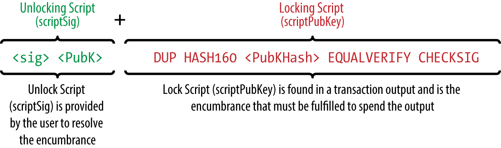

# 交易脚本(Transaction Script)

交易的每个输入存在字段scriptSig, 每个输出存在字段scriptPubKey, 这两个字段分别存储一段脚本: scriptSig用来解锁UTXO, scriptPubKey用于锁定UTXO.

在验证交易期间, scriptPubKey和scriptKey会被脚本引擎执行, 当且仅当返回结果为true时, 交易有效.

 

 

## scriptSig与scriptPubKey分开执行
在2010年前的bitcoin客户端中, scriptSig与scriptPubKey被串接后再由脚本引擎执行, 这种方案可以通过构造特殊的scriptPubKey进行攻击, 之后修改为先执行scriptSig，然后将执行后的栈(stack)进行拷贝再用于执行scriptPubKey.

# 脚本特点
- 基于栈的语言

    脚本执行过程数据的存取都通过栈完成

- 图灵不完备

    bitcoin的脚本不支持循环控制结构, 这使得脚本的复杂度有限, 并且执行时间可预测, 可以避免死循环或一些形式的"逻辑炸弹".

- 无状态

    脚本执行的所有数据都包含在脚本中, 没有外部数据依赖

 

以脚本: "2 3 ADD 5 EQUAL"为例

 

# 参考资料
- [bitcoin wiki: Script](https://en.bitcoin.it/wiki/Script)
